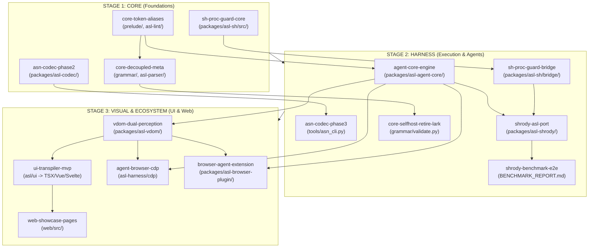

# Master Ecosystem Roadmap & Strategic Linear DAG (`master-unified-ecosystem-v1`)

> **Strategic Directive**: Strict sequential milestone progression:
> **Stage 1: CORE (Language, Vocab, Codec, Meta)** ➔ 
> **Stage 2: HARNESS (Agent Engine, Process Guard, Onion Middleware, Shrody Micro-Harness)** ➔ 
> **Stage 3: VISUAL & ECOSYSTEM (VDOM, UI Dialect, Web Showcase Redesign, Browser Copilot)**.

---

## 1. Milestone Table

### STAGE 1: CORE (Foundational Language & Data Substrate)
*Zero external dependencies. Must check 100% green before Stage 2 begins.*

| ID | Priority | Depends On | Isolation | Exclusive File Ownership (`owns`) | Status | Verification Gate |
|---|---|---|---|---|---|---|
| `core-token-aliases` | `P0` | `[]` | `single-tree` | `prelude/`, `web/public/llms.txt`, `packages/asl-lint/src/core/tokens.asl` | `ready` | `.venv/bin/python prelude/generate.py --check && .venv/bin/python bench/token_audit.py --check` |
| `asn-codec-phase2` | `P0` | `[]` | `single-tree` | `packages/asl-codec/` | `ready` | `.venv/bin/python -m pytest packages/asl-codec -q && .venv/bin/python grammar/validate_asn.py` |
| `sh-proc-guard-core` | `P0` | `[]` | `single-tree` | `packages/asl-sh/src/` | `ready` | `.venv/bin/python checker/gate.py && .venv/bin/python tools/native_parser.py packages/asl-sh/src/reducer.asl` |
| `core-decoupled-meta` | `P1` | `["core-token-aliases"]` | `single-tree` | `grammar/`, `packages/asl-parser/src/ast.asl`, `tools/lsp.py` | `pending` | `.venv/bin/python grammar/validate.py && .venv/bin/python checker/gate.py && .venv/bin/python -m pytest tools/tests/test_native_parity.py -q` |

---

### STAGE 2: HARNESS (Agent Engine, Middleware & Execution Matrix)
*Depends on Stage 1 Core. Builds the autonomous execution environment.*

| ID | Priority | Depends On | Isolation | Exclusive File Ownership (`owns`) | Status | Verification Gate |
|---|---|---|---|---|---|---|
| `sh-proc-guard-bridge` | `P0` | `["sh-proc-guard-core"]` | `single-tree` | `packages/asl-sh/bridge/`, `packages/asl-sh/tests/` | `pending` | `npx tsx packages/asl-sh/tests/test_host_supervisor.ts && npx tsx packages/asl-sh/tests/test_query.ts` |
| `agent-core-engine` | `P0` | `["core-token-aliases"]` | `single-tree` | `packages/asl-agent-core/`, `packages/asl-harness/src/onion/` | `pending` | `.venv/bin/python checker/gate.py && .venv/bin/python -m pytest packages/asl-agent-core/tests -q` |
| `asn-codec-phase3` | `P1` | `["asn-codec-phase2"]` | `single-tree` | `tools/asn_cli.py`, `packages/asl-cli/src/asn.asl` | `pending` | `python3 tools/asn_cli.py --help && .venv/bin/python bench/asn_tokens.py --check` |
| `shrody-asl-port` | `P0` | `["sh-proc-guard-bridge", "agent-core-engine"]` | `single-tree` | `packages/asl-shrody/` | `pending` | `node --test packages/asl-shrody/test/policy.test.js && node --test packages/asl-shrody/test/triage.test.js` |
| `shrody-benchmark-e2e` | `P1` | `["shrody-asl-port"]` | `single-tree` | `packages/asl-shrody/benchmark/`, `BENCHMARK_REPORT.md` | `pending` | `node packages/asl-shrody/benchmark/run.js --check` |
| `core-selfhost-retire-lark` | `P2` | `["core-decoupled-meta"]` | `single-tree` | `grammar/validate.py`, `tools/doc_examples.py` | `pending` | `.venv/bin/python grammar/validate.py && .venv/bin/python tools/doc_examples.py --quiet` |

---

### STAGE 3: VISUAL & ECOSYSTEM (Perception, UI Dialect & Web Showcase)
*Depends on Stage 1 & 2. Front-facing visual layer and developer experience.*

| ID | Priority | Depends On | Isolation | Exclusive File Ownership (`owns`) | Status | Verification Gate |
|---|---|---|---|---|---|---|
| `vdom-dual-perception` | `P1` | `["agent-core-engine"]` | `single-tree` | `packages/asl-vdom/` | `pending` | `.venv/bin/python checker/gate.py && .venv/bin/python ./agentscript test packages/asl-vdom/tests/vdom_test.asl` |
| `ui-transpiler-mvp` | `P1` | `["vdom-dual-perception"]` | `single-tree` | `packages/asl-vdom/src/html.asl`, `packages/asl-codegen/src/emit_jsx.asl` | `pending` | `.venv/bin/python ./agentscript compile --target tsx packages/asl-vdom/examples/card.asl -o /tmp/Card.tsx && npx tsc --noEmit /tmp/Card.tsx` |
| `agent-browser-cdp` | `P1` | `["vdom-dual-perception", "agent-core-engine"]` | `single-tree` | `packages/asl-harness/bridges/browser_cdp.py` | `pending` | `.venv/bin/python -m pytest packages/asl-harness/tests/test_browser_cdp.py -q` |
| `browser-agent-extension` | `P1` | `["vdom-dual-perception", "agent-core-engine"]` | `single-tree` | `packages/asl-browser-plugin/` | `pending` | `npm --prefix packages/asl-browser-plugin run build && npm --prefix packages/asl-browser-plugin test` |
| `web-showcase-pages` | `P1` | `["ui-transpiler-mvp"]` | `single-tree` | `web/src/` | `pending` | `npm --prefix web run build && .venv/bin/python tools/deploy_check.py` |
| `ecosystem-full-verification` | `P0` | All prior phases | `single-tree` | `ROADMAP.md`, `.plans/STATUS.md` | `pending` | `tools/hooks/pre-commit` |

---

## 2. Stage Execution Dependency Graph

---

## 3. Disjoint Ownership Verification for Stage 1 (Core)

Внутри **Stage 1 (CORE)** первые три параллельные фазы имеют строго нулевое пересечение по файлам:
1. `core-token-aliases`: `prelude/`, `web/public/llms.txt`, `packages/asl-lint/src/core/tokens.asl`
2. `asn-codec-phase2`: `packages/asl-codec/`
3. `sh-proc-guard-core`: `packages/asl-sh/src/`

После их закрытия стартует:
4. `core-decoupled-meta`: `grammar/`, `packages/asl-parser/src/ast.asl`, `tools/lsp.py`
