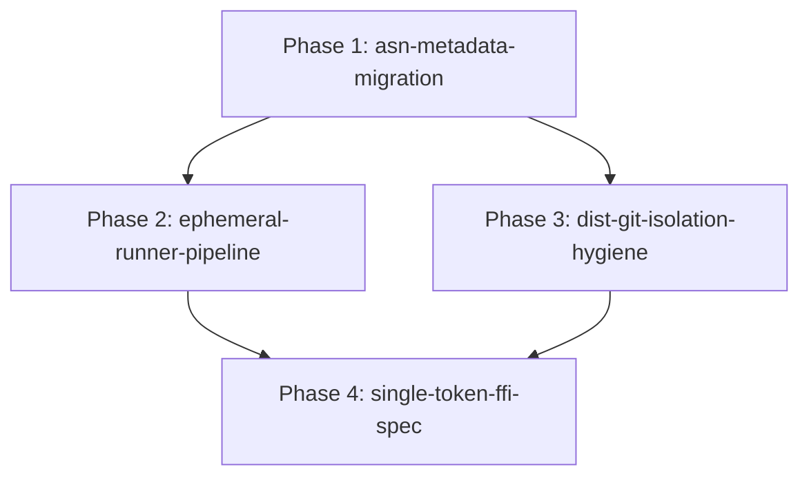

# Pure ASL & Ephemeral Architecture Initiative — PHASES

## Overview
Eliminate non-ASL persistent files, replace JSON configs with native ASN data frames, enforce ephemeral execution for host bridges/tests (compilation to memory/tmp -> execution -> auto-unlink, zero `.js`/`.ts`/`.py` in git), isolate foreign language emissions strictly to `dist/`, and standardize single-token FFI syscalls.

## Phases DAG

| Phase ID | Owns | Depends On | Gate Command | Isolation | Status |
|---|---|---|---|---|---|
| `asn-metadata-migration` | `*/asl.asn`, `*/manifest.asn`, `pack/` | `[]` | `node asl/bin/asl gate pack/src/pack.asl` | `single-tree` | `pending` |
| `ephemeral-runner-pipeline` | `pack/bridges/asl_runner.js`, `*/benchmark/` | `[asn-metadata-migration]` | `node asl/bin/asl test pack/tests/standalone.test.asl` | `single-tree` | `pending` |
| `dist-git-isolation-hygiene` | `*/.gitignore`, `harness/`, `browser-plugin/` | `[asn-metadata-migration]` | `python3 tools/sync_workspace.py` | `single-tree` | `pending` |
| `single-token-ffi-spec` | `asl/`, `pack/src/ffi_linker.asl` | `[ephemeral-runner-pipeline, dist-git-isolation-hygiene]` | `node asl/bin/asl check pack/src/ffi_linker.asl` | `single-tree` | `pending` |
