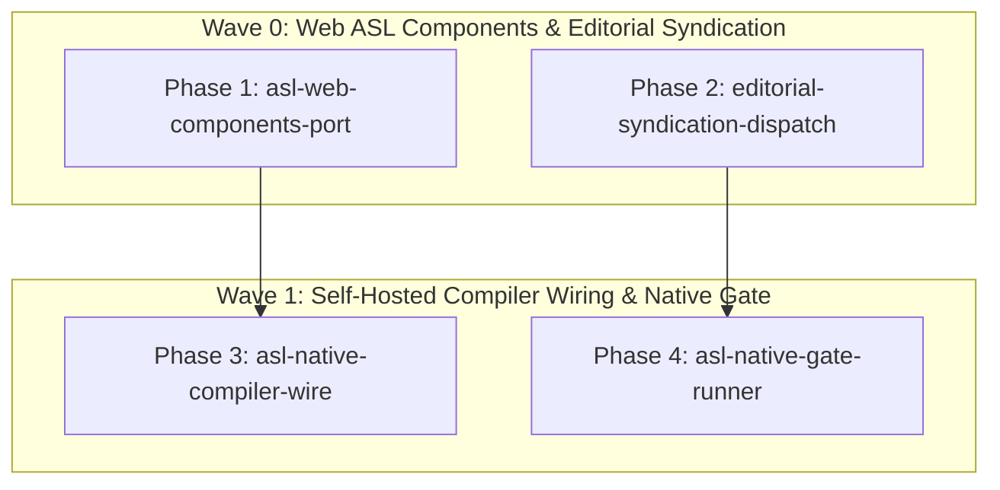

# Tri-Frontier Expansion & Final Self-Hosting — PHASES

## Overview
Simultaneous execution across the three remaining ecosystem frontiers:
1. Web Showcase: Port core React UI components to declarative pure ASL via `vite-plugin-asl`.
2. Editorial Syndication: Prepare technical launch announcements and syndication drafts for Quantum and Arduino capabilities.
3. Native Self-Hosted Pipeline: Wire the end-to-end self-hosted compiler and native verification gate runner.

## Phases DAG

| Phase ID | Owns | Depends On | Priority | Gate Command | Status |
|---|---|---|---|---|---|
| `asl-web-components-port` | `web/asl-src/components/` | `[]` | `P0` | `node asl/bin/asl gate asl/web/asl-src/components/Hero.asl asl/web/asl-src/components/UnifiedPackageMatrix.asl asl/web/asl-src/components/AslQualityDoctor.asl && npm --prefix asl/web run build` | `pending` |
| `editorial-syndication-dispatch` | `editorial-matrix/syndication/` | `[]` | `P0` | `python3 editorial-matrix/scripts/validate_articles.py` | `pending` |
| `asl-native-compiler-wire` | `packages/asl-compiler/` | `[asl-web-components-port]` | `P1` | `node asl/bin/asl gate asl/packages/asl-compiler/src/compiler.asl` | `pending` |
| `asl-native-gate-runner` | `packages/asl-cli/`, `packages/asl-gates/` | `[editorial-syndication-dispatch]` | `P1` | `node asl/bin/asl gate asl/packages/asl-cli/src/cli.asl asl/packages/asl-gates/src/gates.asl` | `pending` |
