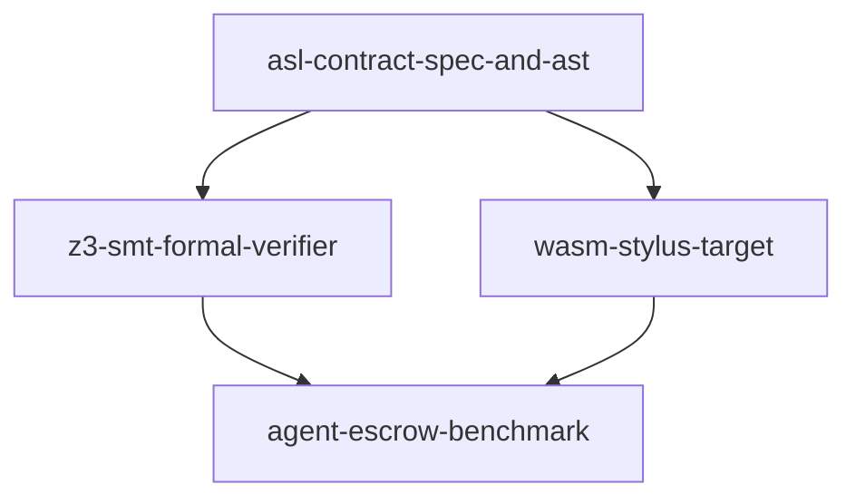

# Linked Roadmap: AgentScript Verifiable Smart Contracts Engine

## Phase DAG & Disjoint Ownership Table

| Phase ID | Dependencies | Owns (Exclusive Patterns) | Priority | Isolation | Verification Gate | Status |
|---|---|---|:---:|---|---|:---:|
| `asl-contract-spec-and-ast` | `[]` | `packages/asl-contracts/manifest.asn` `packages/asl-contracts/src/spec.asl` `packages/asl-contracts/tests/spec_test.asl` | **P0** | `single-tree` | `asl test asl/packages/asl-contracts/tests/spec_test.asl` | `ready` |
| `z3-smt-formal-verifier` | `["asl-contract-spec-and-ast"]` | `packages/asl-contracts/src/smt.asl` `packages/asl-contracts/tests/smt_test.asl` | **P1** | `single-tree` | `asl test asl/packages/asl-contracts/tests/smt_test.asl` | `pending` |
| `wasm-stylus-target` | `["asl-contract-spec-and-ast"]` | `packages/asl-contracts/src/stylus_abi.asl` `packages/asl-contracts/tests/stylus_test.asl` | **P1** | `single-tree` | `asl test asl/packages/asl-contracts/tests/stylus_test.asl` | `pending` |
| `agent-escrow-benchmark` | `["z3-smt-formal-verifier", "wasm-stylus-target"]` | `packages/asl-contracts/examples/escrow.asl` `packages/asl-contracts/tests/escrow_test.asl` | **P1** | `single-tree` | `asl test asl/packages/asl-contracts/tests/escrow_test.asl` | `pending` |

## Wave Schedule
- **Wave 0**:
  - `asl-contract-spec-and-ast`
- **Wave 1 (Parallel Execution)**:
  - `z3-smt-formal-verifier`
  - `wasm-stylus-target`
- **Wave 2**:
  - `agent-escrow-benchmark`
