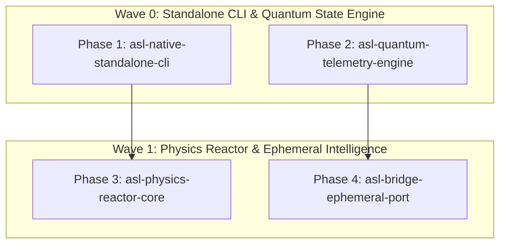

# Autonomous ASL Frontier & Native Engine Initiative — PHASES

## Overview
Implement standalone native AOT compilation for the ASL CLI, state-vector quantum simulation in pure ASL, unified single-source physics reactor in `asl-vdom`, and ephemeral bridge migration in `intel`.

## Phases DAG

| Phase ID | Owns | Depends On | Priority | Gate Command | Status |
|---|---|---|---|---|---|
| `asl-native-standalone-cli` | `pack/src/standalone.asl`, `pack/bridges/bundler.js`, `pack/tests/` | `[]` | `P0` | `node asl/bin/asl test pack/tests/standalone.test.asl` | `done` |
| `asl-quantum-telemetry-engine` | `packages/asl-quantum/src/simulator.asl`, `packages/asl-quantum/src/quantum.asl`, `packages/asl-quantum/tests/` | `[]` | `P0` | `node bin/asl test packages/asl-quantum/tests/simulator_test.asl` | `done` |
| `asl-physics-reactor-core` | `packages/asl-vdom/src/physics_reactor.asl`, `packages/asl-vdom/tests/` | `[asl-native-standalone-cli]` | `P1` | `node bin/asl test packages/asl-vdom/tests/physics_test.asl` | `done` |
| `asl-bridge-ephemeral-port` | `intel/src/extractor.asl`, `intel/tests/` | `[asl-quantum-telemetry-engine]` | `P1` | `node bin/asl gate intel/src/extractor.asl` | `done` |
