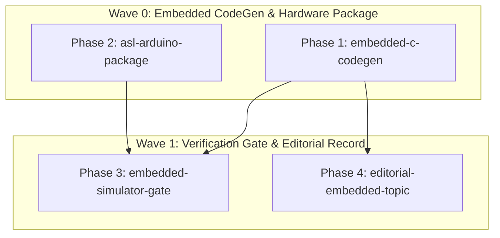

# Embedded Hardware & Arduino Frontier — PHASES

## Overview
Implement embedded C and Arduino code generation in `@genseam/asl-codegen`, create `@genseam/asl-arduino` with direct hardware GPIO/Serial abstractions, integrate virtual signal simulation test gates, and document in the editorial matrix.

## Phases DAG

| Phase ID | Owns | Depends On | Priority | Gate Command | Status |
|---|---|---|---|---|---|
| `embedded-c-codegen` | `packages/asl-codegen/src/emit-c.asl`, `packages/asl-codegen/tests/c-codegen-test.asl` | `[]` | `P0` | `node asl/bin/asl gate asl/packages/asl-codegen/src/emit-c.asl` | `done` |
| `asl-arduino-package` | `packages/asl-arduino/` | `[]` | `P0` | `node asl/bin/asl gate asl/packages/asl-arduino/src/gpio.asl asl/packages/asl-arduino/src/serial.asl` | `done` |
| `embedded-simulator-gate` | `packages/asl-arduino/tests/` | `[embedded-c-codegen, asl-arduino-package]` | `P1` | `node asl/bin/asl test asl/packages/asl-arduino/tests/gpio-test.asl` | `done` |
| `editorial-embedded-topic` | `editorial-matrix/`, `asl/README.md` | `[embedded-c-codegen]` | `P1` | `python3 editorial-matrix/scripts/validate_articles.py` | `done` |
