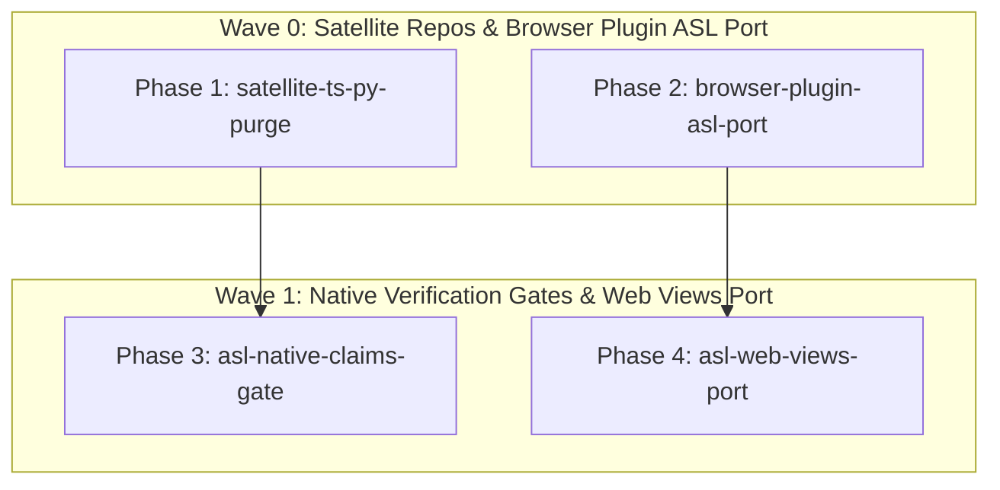

# Non-ASL Eradication Initiative — PHASES

## Overview
Eliminate remaining TypeScript and Python files across satellite repositories and the web showcase, porting host bridges, perception logic, browser plugin sources, and verification gates to pure AgentScript.

## Phases DAG

| Phase ID | Owns | Depends On | Priority | Gate Command | Status |
|---|---|---|---|---|---|
| `satellite-ts-py-purge` | `harness/`, `mem/`, `agent-bus/`, `eddie/`, `voice/`, `vdom/` | `[]` | `P0` | `node asl/bin/asl gate harness/src/browser_cdp.asl mem/src/driver.asl vdom/src/perception.asl` | `done` |
| `browser-plugin-asl-port` | `browser-plugin/src/*.asl` | `[]` | `P0` | `node asl/bin/asl gate browser-plugin/src/background.asl browser-plugin/src/content.asl` | `done` |
| `asl-native-claims-gate` | `packages/asl-gates/src/site_claims.asl` | `[satellite-ts-py-purge]` | `P1` | `node bin/asl gate packages/asl-gates/src/site_claims.asl` | `done` |
| `asl-web-views-port` | `web/asl-src/ArchitectureView.asl`, `web/asl-src/EcosystemView.asl` | `[browser-plugin-asl-port]` | `P1` | `node bin/asl gate web/asl-src/ArchitectureView.asl web/asl-src/EcosystemView.asl` | `done` |
