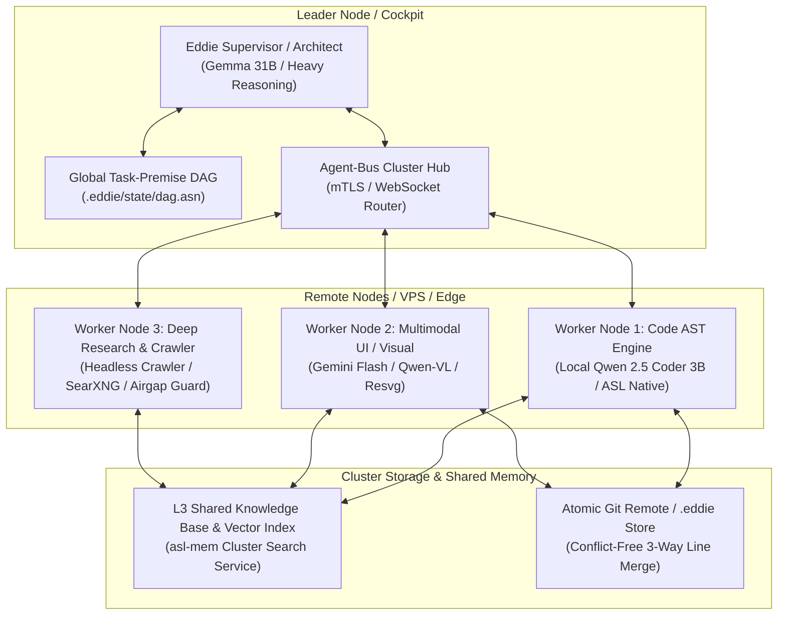

# RFC: Cluster-Native Eddie & Distributed Heterogeneous Agent Swarm Architecture

**Status:** Proposed / Architectural RFC  
**Date:** 2026-09-06  
**Target:** Next-Generation Multi-Node Autonomous Agent Systems  
**Author:** GenSEAM Architecture Group  

---

## 1. Executive Summary & Vision

Today, EDDIE operates primarily as a single-host, high-performance autonomous agent pairing an in-memory deterministic OS with a local or gateway-connected semantic ALU. Single-host execution excels at rapid, localized coding loops (<71ms verification gates, <15ms dependency inspection, 0-copy RAM staging).

However, real-world software engineering at scale spans:
1. **Long-running background tasks**: Continuous fuzzing, whole-codebase AST migrations, security auditing, and deep crawling.
2. **Heterogeneous & Multimodal Specialization**: Combining fast, local micro-models (Qwen 2.5 Coder 3B) for cheap AST edits with multimodal vision models (Gemini 2.5 Flash / Qwen-VL) for visual UI regressions, and heavy reasoning engines (Gemma 31B) for architectural decisions.
3. **Cluster Resource Distribution**: Running headless, low-overhead Eddie nodes across remote VPSs, edge hardware, and developer machines, consuming minimal tokens while collaborating asynchronously.

This RFC defines the **Cluster-Native Eddie Swarm**: a distributed, event-driven mesh of lightweight Eddie instances coordinating over the **ASN Agent-Bus Wire Protocol**, backed by a **Tiered Memory Hierarchy (L1-L3)** and specialized **Spheres of Responsibility**.

---

## 2. Cluster Node Topology



### Key Node Types:
1. **Leader / Architect Node**:
   - Maintains the global Task DAG and falsified premise tree.
   - Decomposes high-level user requests into granular, isolated work items.
   - Mints and verifies cryptographic completion receipts (`(:receipt ...)`).
2. **AST & Coder Workers (Remote VPS / MicroVMs)**:
   - Ultra-lightweight footprint (<100MB RAM, pure ASL/Wasm runtime).
   - Ingests codebases into RAM via `asl mem index .` in <150ms.
   - Executes compiler passes, runs tests, and stages edits in local WAL.
3. **Multimodal & UI Workers**:
   - Takes DOM snapshots and screenshot renders.
   - Converts visual bug reports into vector drawings and SVG S-expressions (`:svg`).
   - Runs headless browser checks via `@genseam/browser-plugin` and `agent-browser`.
4. **Research & Crawler Workers**:
   - Houses search proxy services (SearXNG, Exa, Brave, Perceptual Crawler).
   - Operates in strict, isolated network sandboxes with domain whitelists.
   - Indexes external documentation directly into compact ASN summaries.

---

## 3. Spheres of Responsibility & Multimodal Model Routing

To prevent the "one-size-fits-all" trap where expensive frontier models are wasted on trivial formatting tasks, each agent node is assigned a distinct **Sphere of Responsibility** matched to its optimal model arm:

| Sphere | Model Profile | Hardware / Environment | Primary Artifacts | Token Economy Target |
|---|---|---|---|---|
| **Architecture & Triage** | Gemma 31B / DeepSeek V3 | LLM Gateway / Server | DAG nodes, ADRs, Verification Gates | ~500 tokens / decision |
| **Local Code Refactor** | Qwen 2.5 Coder 3B | Apple Silicon M1 / Remote Edge VPS (<2GB RAM) | AST diffs, Unit test passes, Function patches | 0 cloud cost, <800 tokens / task |
| **Visual UI / Multimodal** | Gemini 2.5 Flash / Qwen2-VL | WebGPU / Cloud GPU | Visual diffs, ASN `:svg` cards, VDOM patches | ~400 tokens / visual check |
| **Deep Research & Indexing** | Local SLM + Crawler | Isolated headless VPS | Pointer blobs (`:ptr`), Fact tuples (`:fact`) | 0 human tokens, 90% blob compaction |

---

## 4. Tiered Memory Hierarchy (L1, L2, L3)

In a distributed swarm, memory cannot be a single shared SQL database or an unconstrained vector dump. We partition memory into three deterministic tiers:

```
[ L1: Ephemeral Context VMM ]  < 3.5k tokens in LLM context (4 slots: Invariants, Receipts, Domain, Frame)
           ▲
           ▼
[ L2: Node-Local RAM Slab   ]  < 150ms ASL-Mem ingestion, Local WAL, AST Cache, Blob Offload Pointers
           ▲
           ▼
[ L3: Cluster Knowledge Mesh]  Shared Vector/Graph Index, Centralized Search Service, Git-native .eddie Store
```

### L1: Ephemeral Context VMM (Per-Turn)
Managed by the harness inside each node. Never exceeds 3,500 tokens. Pinned domain knowledge is loaded on-demand and wiped immediately after verification.

### L2: Node-Local Memory Slab (Per-Worker)
In-memory RAM buffer containing the repository's AST, local dirty buffers, and pointer storage (`asl mem ptr`). Enables instant edits and rollbacks (`wal-rollback-unflushed`) without touching network or disk.

### L3: Cluster Shared Knowledge Mesh & Blackboard
1. **Centralized Knowledge & Search Services**:
   - A dedicated lightweight service (`asl cluster search` / `asl cluster kb`) hosting semantic embeddings across company repositories, documentation, and external APIs.
   - Queryable via compact ASN RPC:
     ```lisp
     (:call :service :kb-search :query "wal rollback implementation" :limit 3)
     ```
2. **Conflict-Free Git-Native State (`.eddie/`)**:
   - State files (`edges.asn`, `decisions.asn`, `falsified.asn`) are sorted, line-oriented S-expressions.
   - When multiple remote workers commit their findings, Git performs conflict-free 3-way line merges.

---

## 5. Distributed Swarm Wire Protocol (`agent-bus`)

The cluster extends our native `@genseam/agent-bus` wire format from Unix Domain Sockets to secure TLS/WebSocket streams:

### 1. Task Propose Frame
```lisp
(:wire :msg-id "w-8001" :op :task-propose
  :from "architect-node"
  :to "worker-node-qwen-1"
  :payload (:task "run-ast-migration"
            :path "agent-core/src/dispatch.asl"
            :gate "asl test agent-core/tests/toolcall_test.asl"
            :budget-tokens 1500))
```

### 2. Task Acceptance & Execution Frame
```lisp
(:wire :msg-id "w-8002" :op :task-accept
  :reply-to "w-8001"
  :worker "worker-node-qwen-1"
  :state :active)
```

### 3. Completion Receipt Frame (Zero-Bloat Result)
Instead of streaming 5,000 lines of terminal output across the cluster, the worker returns a cryptographic receipt:
```lisp
(:wire :msg-id "w-8003" :op :task-complete
  :reply-to "w-8001"
  :receipt (:receipt :node "worker-node-qwen-1"
                     :action "ast-migration"
                     :status :pass
                     :diff-summary "+14 -2 lines in dispatch.asl"
                     :gate-ms 42))
```

---

## 6. Token Economy: "Consuming Half a Token a Day"

Why does this cluster model consume orders of magnitude fewer tokens than conventional multi-agent frameworks (AutoGPT, CrewAI, LangGraph)?

1. **In-Process Compilation**: Workers don't query LLMs to parse files; they use native AST search (`asl intel search`) and fast local regex/S-expression walkers.
2. **Receipts vs Transcripts**: The orchestrator never receives raw execution logs. It only receives verified ASN receipts (`(:receipt ...)`).
3. **Local Micro-Model Autonomy**: Routine refactors and syntax fixes run on local Qwen 2.5 Coder 3B on remote nodes, costing $0.00 and 0 external API calls.
4. **Targeted Knowledge Hydration**: Libraries are parsed from local `.d.ts` stubs into 120-token pinned slots, completely eliminating external web searches and API reference context dumping.

---

## 7. Phased Implementation Roadmap

When we are ready to operationalize the cluster development workflow, the following roadmap stages will be executed:

- **Stage 1: Cluster Network Transport (`agent-bus-net`)**
  - Add authenticated WebSocket / TLS client-server bridge to `agent-bus`.
  - Implement worker node registration and heartbeat discovery (`join-swarm`, `worker-heartbeat`).
- **Stage 2: Centralized Knowledge & Vector Service (`asl-cluster-kb`)**
  - Stand up headless ASL memory daemon capable of serving multi-repo semantic vector queries over HTTP/mTLS.
  - Implement remote dependency and documentation caching.
- **Stage 3: Multimodal UI Worker Integration**
  - Integrate headless screenshotting and visual regression tester into worker loop.
  - Transpile visual test failures into ASN vector annotations for rapid UI correction.
- **Stage 4: Distributed DAG Scheduler & Conflict-Free Commit Engine**
  - Distribute tasks across available worker nodes based on capability matrix.
  - Auto-merge `.eddie/graph/` state additions and trigger automated verification gates on merge.

---

## 8. Conclusion & Notes

The transition from a single-machine assistant to a distributed cluster swarm represents the natural maturity of the Agent OS architecture. Because our foundation is already built on deterministic S-expressions, Zero-Foreign code, and compact wire protocols, scaling out to 10 or 100 remote Eddie workers requires zero framework rewrites—only the addition of network-level wire bridges and shared memory endpoints.
