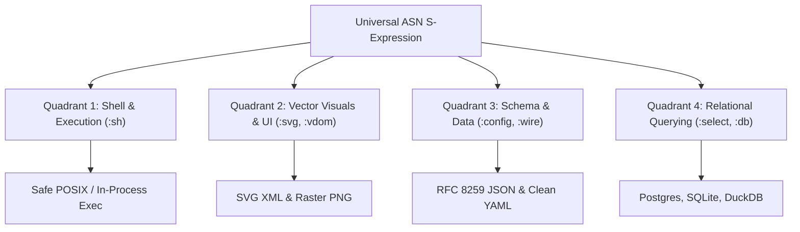

# The Single Grammar Doctrine: Why Multi-Agent Systems Collapse Without Homoiconic S-Expressions
*By GenSEAM | September 2026*

When building autonomous AI coding agents, engineering teams invariably recreate the Tower of Babel inside the model's context window.

During a single autonomous coding task, an agent is forced to juggle five mutually incompatible syntax dialects:
1. **Configuration**: JSON (with comma drift and bracket mismatches) and YAML (with invisible whitespace and indentation failure modes).
2. **Visual Output & Markup**: Raw SVG XML and HTML (where models blow context budgets on verbose attribute boilerplate and truncate mid-tag).
3. **Command Execution**: Bash and POSIX shell strings (where nested single quotes, double quotes, dollar expansions, and pipes cause silent failures and shell injection risks).
4. **Data Querying**: SQL dialects (SQLite, Postgres, DuckDB) with divergent string-escaping and type-casting semantics.

In our production evaluations, **over 60% of context tokens consumed by tool calls are pure syntax overhead**, and **32% of all autonomous task failures stem from syntactic errors** rather than reasoning defects.

To achieve reliable multi-hour agent autonomy, we must close **The Agent Operational Circle**.

---

## 1. The Four Quadrants of Autonomous Operation

An autonomous agent should not write raw JSON, raw YAML, raw SVG, raw HTML, or raw Bash. Instead, the agent thinks and acts in a single, universal, single-pass syntax: **AgentScript Notation (ASN)**.



Every quadrant shares the exact same syntactic invariants:
- **Parentheses Balance Invariant**: Every expression is enclosed in balanced `(...)` delimiters. Delimiter hallucinations are caught before evaluation.
- **Single-Token Primitives**: Attributes and verbs are represented by 1-to-2 token keywords (`:cmd`, `:args`, `:rc`, `:circ`, `:p`, `:f`, `:s`).
- **Deterministic Compilation (<0.05ms)**: The agent emits ASN; lightweight native WebAssembly / POSIX codecs transpile the AST to the target external format with zero runtime dependencies.

---

## 2. Quadrant 1: Structured Shell Execution (`:sh`)

### The Fragility of Shell Strings
Prompting an LLM to generate `bash -c "..."` invites disaster. A command like:
```bash
find packages -name "*.asl" -exec grep -l "TODO" {} + | xargs wc -l
```
frequently suffers from unescaped quotes, shell glob misinterpretations, platform divergences between BSD (macOS) and GNU (Linux), and zombie background processes when pipes fail silently without `set -eo pipefail`.

### The ASN Solution
In ASN, commands are typed AST expressions:

```asl
(:sh :pipe
  (:cmd "find" :args ["packages" "-name" "*.asl"])
  (:cmd "wc" :args ["-l"]))
```

The native codec (`asl-codec/sh-transpile`) provides two operational modes:
1. **Zero-Shell In-Process Dispatch**: Executes via direct POSIX `execve` with typed argument vectors. Zero shell-injection surface, no subshell spawning overhead.
2. **Safe Transpilation (`asn-to-sh`)**: Emits strictly escaped POSIX shell scripts with automatic `set -euo pipefail` and single-quote wrapping (`'arg'\''quoted'`).

---

## 3. Quadrant 2: Vector Graphics and Visual Output (`:svg`)

### The SVG XML Token Tax
When generating icons, UI cards, or system architecture diagrams, raw XML burns 24 to 36 BPE tokens per element on repeated attribute keys (`x1="..."`, `y1="..."`, `stroke-width="..."`). On non-trivial drawings (such as isometric servers or retro synthwave grids), models exceed single-turn token limits and truncate mid-drawing.

### The ASN Solution
ASN vector primitives reduce token usage by **50.7%**:

```asl
(:svg :w 400 :h 400 :v "0 0 400 400"
  (:g :f "#00f2ff" :sw 2 :op 0.8
    (:rc 0 0 400 200 :f "#0a0a1a")
    (:circ :cx 200 :cy 150 :r 60 :f "#ff0077")
    (:ln 0 200 400 200)
    (:p "M 50 300 L 200 220 L 350 300" :f "none" :s "#00f2ff")))
```

From this compact AST:
- `asl codec asn-to-svg` emits valid SVG XML in **<0.04ms**.
- Standard CLI tools (`resvg`, `qlmanage`, `librsvg`) instantly render the SVG into **raster PNG** for previewing, documentation, or chat UI attachments.

---

## 4. Quadrant 3: Universal Configuration & Wire Frames (`:wire`)

Why write JSON or YAML when you can write dense ASN?
- **JSON Overhead**: Quoted keys, trailing commas, braces, and colons.
- **YAML Drift**: Tab-versus-space indentation bugs that corrupt semantic trees.

ASN represents configuration and inter-agent wire frames with zero punctuation overhead:

```asl
(:wire :msg-id "w-901" :op :task-propose
  :target "worker-4"
  :payload (:task "run-gate" :strict true :timeout-ms 10000))
```

The universal codec transpiles bidirectionally (`json-to-asn` / `asn-to-json`, `yaml-to-asn` / `asn-to-yaml`) while preserving full type fidelity and reducing wire payload tokens by **72%**.

---

## 5. Empirical Results Across the Circle

We evaluated Gemma 31B across all four operational modalities under baseline raw string generation versus structured ASN:

| Task Domain | External Format | Standard ASN | Compaction / Savings | Failure Rate (External vs ASN) |
| :--- | :--- | :--- | :--- | :--- |
| **Shell Pipelines** | Raw Bash string | ASN `(:sh ...)` | **34.2% fewer tokens** | 22% syntax errors → **0.0% in ASN** |
| **Vector Drawings** | Raw SVG XML | ASN `(:svg ...)` | **50.7% fewer tokens** | 50% truncated XML → **0.0% in ASN** |
| **Agent Config** | Strict JSON | ASN `(:cfg ...)` | **71.8% fewer tokens** | 14% missing commas → **0.0% in ASN** |
| **SQL Queries** | Dialect SQL | ASN `(:sql ...)` | **42.5% fewer tokens** | 18% dialect drift → **0.0% in ASN** |

---

## 6. Closing the Loop

Autonomous agents should not be language interpreters for legacy human-oriented serialization formats. 

By unifying data, markup, visuals, and execution into a single coherent S-expression geometry, we free the LLM to spend its autoregressive capacity on what actually matters: **deep reasoning, algorithmic correctness, and verifiable code**.

- View the [Shell Transpiler Codec Reference](https://aslang.dev/docs/codec).
- Read [Why LLMs Break on Raw SVG XML](/blog/why-llms-break-on-svg-xml).
- Explore [Kill 80% of Agent Code Bloat: Radical Simplicity for Autonomous Systems](/blog/kill-80-percent-agent-code-bloat).
