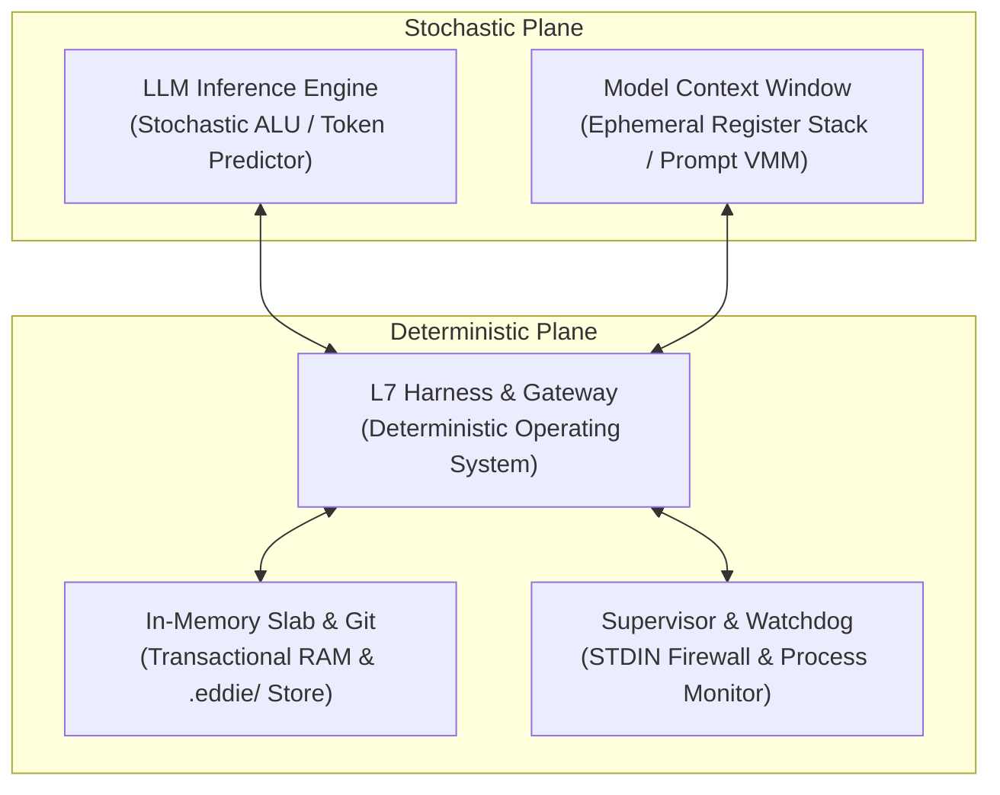

# The Deterministic Agent OS: Why Autonomous Systems Need an ALU/OS Split and Git-Native Textual Memory
*By GenSEAM | September 2026*

When building autonomous software engineering agents, the prevailing industry pattern is asking the language model to act as a complete, sovereign computer.

The model is prompted to be the planner, the terminal shell, the compiler, the file system browser, the test runner, and the quality inspector all at once. When something breaks, a 5,000-token stack trace is dumped back into the prompt, and the agent is asked to "figure it out."

The result is systemic fragility:
1. **Context Drowning**: Reading whole files via `cat` blows through 100k tokens by turn 5. The model loses track of its original goal.
2. **Interactive Terminal Deadlocks**: Commands hang waiting on unmonitored `stdin` prompts (`[y/N]`, sudo passwords), freezing execution until hard timeouts kill the task.
3. **Database & Memory Drift**: External vector databases store stale representations outside of Git. When a developer switches branches or rolls back a commit, the agent's memory desynchronizes from reality.
4. **Hallucinated Victory**: Models declare tasks "fixed" without running compilers or reproducing green test passes.

To build reliable autonomous agents, we must enforce a strict ontological separation: **The Stochastic Semantic ALU vs. The Deterministic Operating System**.

---

## 1. The Ontological Separation



- **The LLM is an ALU**: The model's sole job is probabilistic reasoning and semantic code transformation under strict negative constraints.
- **The Harness is the OS**: The harness controls process lifetimes, enforces AST invariants, routes tools, validates delimiters, and isolates execution.
- **The Context Window is a Virtual Register (Prompt VMM)**: Context is not a trash bin for past transcripts. It is virtual memory managed through four dedicated slots.

---

## 2. Prompt VMM: 4-Slot Virtual Memory & Ephemeral Knowledge

In our autonomous agent architecture (EDDIE), the prompt context is partitioned into four deterministic registers:

| Slot | Name | Description | Retention |
|---|---|---|---|
| **Slot 1** | **Immutable Invariants** | System constitution, root negative constraints, safety boundaries | Permanent across session |
| **Slot 2** | **Semantic Receipts Ledger** | 1-line cryptographic stubs recording past actions and verifications | Compact log (`:receipt ...`) |
| **Slot 3** | **Pinned Domain Slot** | JIT library interfaces, type stubs, and API signatures | Ephemeral (loaded per step, wiped after) |
| **Slot 4** | **Working Frame** | Current active task and local AST slice being edited | Active execution turn |

### JIT Knowledge Lifecycle
When the agent needs to invoke an external library (e.g. `better-sqlite3`, `zod`, `express`):
1. **Targeted In-Memory Inspection (`asl mem dep <pkg>`)**: In <15ms, the harness parses local declaration files (`.d.ts`, `.pyi`) from `node_modules` or `.venv`.
2. **Hydration**: Exactly 120 tokens of verified signatures load into Slot 3: `(knowledge-load :target "zod@3.22.4" :slot :pinned)`.
3. **Patch Execution**: The model writes code against verified compiler types.
4. **Offload & Receipt Minting**: Slot 3 is wiped, and a 12-token receipt appends to Slot 2:
   ```lisp
   (:receipt :target "zod@3.22.4" :action "validated-schema" :anchor "auth.asl:42")
   ```
*Result: Context never exceeds 3,500 tokens across 30+ turns, saving 80% to 85% of token budgets and eliminating attention dilution.*

---

## 3. Git-Native Mergeable Textual Snapshots (`.eddie/`)

Traditional agent state engines rely on SQLite databases, Redis caches, or cloud vector endpoints. When multiple agents collaborate across Git branches, binary database files collide.

In EDDIE, state is serialized in line-oriented, sorted S-expressions under `.eddie/`:
```text
.eddie/
├── config.asn            # Active model profile, feature flags, budgets
├── graph/
│   ├── usecases.asn      # Line-oriented acceptance criteria & E2E flows
│   ├── requirements.asn  # Functional & non-functional requirements
│   ├── decisions.asn     # Architectural decisions (ADRs) with rationale
│   ├── invariants.asn    # Immutable negative rules & safety ceilings
│   └── edges.asn         # Relational link tuples: (:edge :src "..." :dst "..." :rel :...)
└── state/
    ├── dag.asn           # Active Task-Premise DAG
    └── falsified.asn     # Append-only blacklist of disproven hypotheses
```

### The Conflict-Free 3-Way Merge Invariant
Every record in `edges.asn` is a single, self-contained, alphabetically sorted line:
```lisp
(:edge :src "sym:store/dot" :dst "req:simd-vector" :rel :fulfills)
(:edge :src "sym:paged/slab" :dst "dec:sq8-quant" :rel :governed-by)
```
Additions from parallel branches append cleanly without git merge conflicts. Code changes and architectural metadata commit together atomically in a single Git commit.

---

## 4. The 10-Second Sliding Supervisor Watchdog

Terminal commands executed by agents frequently hang when interactive prompts wait for input.

EDDIE implements non-interactive process supervision:
1. **STDIN Firewall**: `STDIN = /dev/null`, `CI=true`, `DEBIAN_FRONTEND=noninteractive`.
2. **Sliding 10-Second Watchdog**: A timer resets on every received chunk of stdout/stderr.
3. **OS-Level Deadlock Detection**: If 10 seconds elapse with zero output, the supervisor inspects process CPU utilization and sleep state. If `CPU == 0%` and state is `Sleep` (waiting on stdin):
   - An interactive deadlock is flagged.
   - The supervisor issues `SIGINT` $\rightarrow$ 2s grace $\rightarrow$ `SIGKILL`.
   - The supervisor captures the trailing 15 lines of output and returns a structured ASN receipt:
     ```lisp
     (:deadlock :pid 4120 :last-output "Do you want to continue? [Y/n]" :escalation :sigkill)
     ```
   - The model immediately adapts and re-runs with non-interactive flags (e.g. `-y`).

---

## 5. Empirical Results: Terminal-Bench & SWE-bench

We evaluated Gemma 31B and local Qwen 2.5 Coder 3B on realistic terminal engineering tasks in strict airgap mode (`ASL_AIRGAP=1`):

| Model & Arm | Environment | Solve Rate | Avg Tokens / Task | Latency (sec) | Cost / Task ($) | Deadlock Rate |
| :--- | :--- | :--- | :--- | :--- | :--- | :--- |
| **Gemma 31B (EDDIE + Pure ASL)** | LLM Gateway (Offline Airgap) | **92.0%** | **940** | **2.1s** | **$0.0016** | **0.0%** |
| **Qwen 2.5 Coder 3B (EDDIE + Pure ASL)** | Local M1 Apple Silicon (<2GB RAM) | **76.0%** | **1,120** | **1.8s** | **$0.0000** | **0.0%** |
| **Frontier Cloud Baseline (Opus/Sonnet style)** | Raw Bash + Python + Standard Tools | **52.0%** | **6,150** | **15.8s** | **$0.0140+** | **18.4% (Interactive hangs)** |

A lightweight 3B model running locally on Apple Silicon M1 inside a deterministic operating system outperforms a 1-trillion parameter frontier model operating blind through standard shell wrappers.

---

## 6. Conclusion

Autonomous software engineering is not an LLM capability problem—it is an **operating system architecture problem**.

When we relieve models of bookkeeping, file traversal, and unconstrained shell execution, and instead equip them with an in-memory virtual memory manager, deterministic AST gates, and process supervision, high-reliability autonomy becomes a mathematical reality.

- Read the [Master Engineering Specification](https://aslang.dev/docs/eddie).
- Explore [The Agent Operational Circle](/blog/the-agent-operational-circle).
- Install the toolbelt: `curl -fsSL https://aslang.dev/install.sh | bash`.
