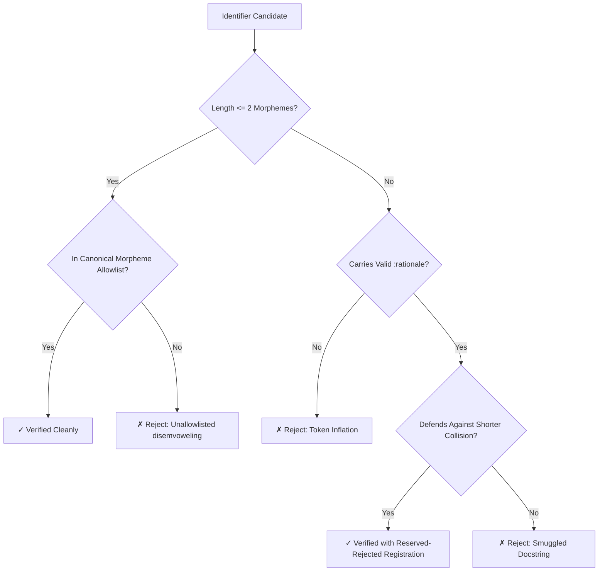

# Why Disemvoweling Breaks BPE: How Naive Token Optimization Destroys Agent Intelligence
*By GenSEAM | September 2026*

When designing domain languages and interfaces for autonomous AI coding agents, the natural instinct of engineers is to optimize for raw string brevity.

If context windows are expensive and attention degrades with sequence length, shouldn't we shorten every identifier to the minimum possible number of characters? Why write `clean-terminal-text` when you can write `ctermtxt` or `cln-term`?

In practice, this naive compression causes autonomous agents to suffer catastrophic reasoning and generation failures. Instead of saving tokens, micro-shortened identifiers trigger **subtoken fracturing**, **noisy embedding priors**, **synonym guessing loops**, and **multi-turn edit collisions**.

Following our recent two-round architectural consultation with Anthropic's **Claude Fable 5** (Mythos-class model), we codified the mathematical and operational principles of **Pure ASL Machine-Understandability and Token Economics**.

Here is why character-level disemvoweling is an anti-pattern, and how AgentScript achieves optimal token density and zero semantic collision.

---

## 1. The Physics of BPE: Why `ctermtxt` and `wrk` Break Down

Byte-Pair Encoding (BPE) and SentencePiece tokenizers do not process code as arbitrary characters. They segment text into statistically frequent subword chunks derived from massive natural language and code corpora.

When an identifier uses standard dictionary morphemes separated by hyphens (e.g. `clean-term`), modern tokenizers (such as OpenAI `cl100k`/`o200k`, Anthropic Claude, and Google Gemma) tokenize each morpheme cleanly:
```text
"clean-term" -> ["clean", "-", "term"]  (3 high-frequency tokens)
```
Each shard is an omnipresent token in the training distribution. It carries a stable, high-confidence vector embedding loaded with semantic associations. The transformer's self-attention mechanism retrieves the concept "for free" directly from the embedding table without needing surrounding context to reconstruct its meaning.

Compare this to aggressive disemvoweling:
```text
"ctermtxt" -> ["c", "term", "txt"]   (3 low-frequency shards)
"wrk"      -> ["w", "rk"]            (2 noisy sub-tokens)
"nrml"     -> ["n", "rm", "l"]       (3 arbitrary shards)
```

Micro-shortening introduces three severe penalties:
1. **Zero Token Savings**: `ctermtxt` consumes exactly as many BPE tokens as `clean-term` (3 tokens), while stripping away human and model legibility.
2. **Noisy Embedding Priors**: Rare shards like `rk` or `rm` have diffuse embeddings with high variance across semantic clusters. Attention heads must burn computational capacity reconstructing meaning from surrounding syntax.
3. **Reproduction & Copy Errors**: Autonomous models exhibit dramatically higher hallucination and typo rates on rare character sequences (e.g., misremembering `ctermtxt` as `ctermtext`, `ctxttrm`, or `ctermtx`), causing compilation failures that require full multi-thousand-token repair turns.

> **The First Law of Agent-Native Morphemes**:  
> Every identifier morpheme must either be a natural dictionary word or an established abbreviation with massive corpus frequency (`cfg`, `ctx`, `fmt`, `msg`, `src`, `dst`, `idx`, `buf`, `len`, `env`, `rc`). Banned: novel or generative disemvoweling.

---

## 2. The Dual Collision: Homonyms vs. Synonyms

In standard compiler design, name resolution focuses strictly on avoiding **homonym collisions** (two different entities sharing the same name). AgentScript's Gate 6 enforces this globally: for example, prohibiting the abbreviation `st` because it ambiguously collides between `state` and `status`.

However, for autonomous agents generating code from parametric memory, **synonym collisions** are equally fatal.

Consider what happens when a codebase allows both `clean-term` and `cln-term` for the same concept:
```text
Task: "Sanitize the terminal buffer output."
Model memory prior: P(clean-term) = 52%, P(cln-term) = 48%
```

Because both forms are valid in the training distribution, the agent guesses the wrong spelling approximately 50% of the time. In an autonomous coding loop:
1. The agent writes `(cln-term buffer)`.
2. The compiler fails with `Unknown symbol 'cln-term'`.
3. The agent must inspect the failure, grep the registry, generate a patch, and re-run tests.
4. **Cost of the 1-token "saving"**: 2,500 prompt tokens and a full repair turn.

AgentScript enforces **exactly one canonical spelling per concept** across all 28 packages, governed by a canonical verb table (`get`, `read`, `del`, `clean`).

---

## 3. The 2-Token Budget & The Boundary Rule for `:rationale`

In AgentScript, every identifier is governed by the **Golden Invariant**:
$$\text{Identifier Budget} \le 2 \text{ Morphemes}$$

Symbols comprising 1 or 2 morphemes (e.g. `read-file`, `parse-asn`, `hash-map`) are self-documenting and pass Gate 6 automatically. Any symbol exceeding 2 morphemes (e.g. `boxed-type-if-recursive` or `dialect-param-prefix`) is strictly flagged by Gate 6 as **token inflation**.

To pass verification, every 3+ morpheme symbol must provide a verified `:rationale` defending why it cannot be compacted:

```lisp
(sym :name dialect-param-prefix
     :tokens 3
     :rationale "Cannot be reduced to 'param-prefix': preserves orthogonal SQL dialect axis against generic query parameters.")
```

Through our consultation with Claude Fable 5, we defined **The Boundary Rule**:
> **The Boundary Rule**:  
> A 3rd+ morpheme is justified if and only if removing it alters *call-site behavioral expectations* (safety invariant, fallback path, lifecycle phase, or semantic axis). If a morpheme merely describes internal implementation ("what the function does"), it is a docstring smuggled into an identifier and must be rejected.

### Justified vs. Rejected Token Inflation
| Identifier | Morphemes | Status | Justification |
| :--- | :---: | :--- | :--- |
| `boxed-type-if-recursive` | 4 | **Valid** | Removing `-if-recursive` erases the conditional safety invariant; caller must know boxing only occurs on recursion. |
| `dialect-param-prefix` | 3 | **Valid** | Removing `dialect-` collides with generic SQL parameter prefixes across execution engines. |
| `calculate-and-format-output` | 4 | **Rejected** | Descriptive fluff. Must be refactored to `format-output` or split into composable functions. |

---

## 4. Agent Operational Physics: Edit-Anchor Uniqueness & Grep Precision

Beyond token counts and BPE embeddings lies a crucial practical constraint of modern AI agents: **how agents actually manipulate files**.

Autonomous agents (including Claude Code, Factory Droid, EDDIE, and Gemini Code) do not operate via AST byte-offsets. They inspect code with `grep` and apply modifications using string-replacement blocks:
```text
<<<<<<< SEARCH
(let [(t (get-text node))]
=======
(let [(txt (get-text node))]
>>>>>>> REPLACE
```

If an identifier is hyper-terse (e.g. `t`, `st`, `cln`, `p`):
1. **Substring Collisions**: `t` matches hundreds of characters across comments, keywords, and strings.
2. **Ambiguous Replacement Errors**: Tool execution rejects the edit with `"Error: Search chunk is not unique in target file"`.
3. **Grep Pollution**: Grepping for `t` or `st` returns tens of thousands of false positives, destroying the agent's context budget.

A 2-morpheme identifier like `clean-term` is word-boundary distinct, instantly greppable, and guaranteed unique within its lexical scope. The economics of agent edit accuracy and token economics point in the exact same direction.

---

## 5. Summary of Calibrated Invariants

Following our 2-round audit with Claude Fable 5, AgentScript adopts the following operational standards:



1. **Closed Tiered Allowlist**: Core system abbreviations (`cfg`, `ctx`, `fmt`, `msg`, `src`, `dst`, `buf`, `len`) and domain compiler terms (`ast`, `ir`, `ssa`, `cps`, `gc`, `ty`) vetted offline against real tokenizers.
2. **Canonical Forms**: Absolute prohibition of parallel synonym variants.
3. **Machine-Audited Rationales**: Every 3+ morpheme symbol documents its rejected shorter form, feeding an append-only `reserved-rejected` registry.
4. **Uniform Rigor**: Zero relaxation for test helpers or internal utilities—consistent few-shot context prevents agent behavioral decay.

By eliminating token inflation, preventing synonym drift, and respecting the physics of BPE tokenizers, AgentScript provides the cleanest, most deterministic substrate for autonomous AI software engineering.

- Read the companion analysis in [Token Economy & Structural Compression](/blog/token-economy-and-structural-compression).
- Explore the [Pure ASL Specification](https://aslang.dev/docs).
- Inspect our [100% Verified Grammar Registries](https://aslang.dev/docs/grammar).
