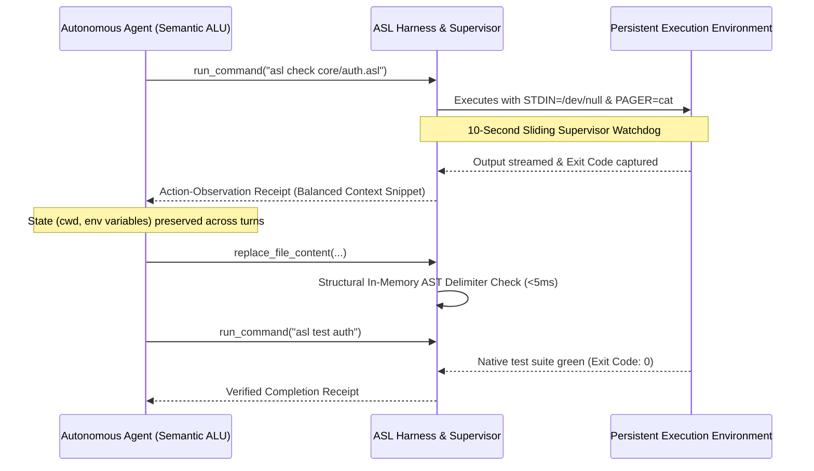
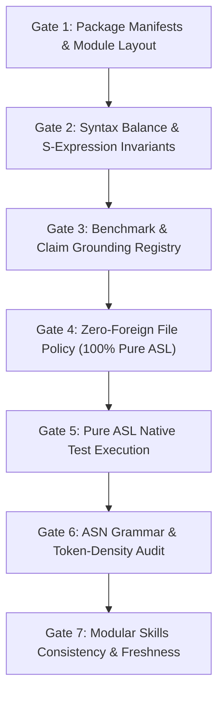

# Why Bash Wrappers Fail Coding Agents: Persistent Action Loops and 7 In-Memory Verification Gates
*By GenSEAM | September 2026*

When building developer tools, compilers, and harnesses for autonomous software engineering agents, the prevailing industry approach is wrapping standard command-line tools in raw bash subprocesses.

The agent is given a shell prompt and asked to navigate complex multi-file repositories using standard human-oriented tools: `cat`, `grep`, `npm test`, `cargo build`, and interactive prompts. When a command fails, thousands of lines of unformatted compiler output flood the context window, and the agent is left to guess how to proceed.

The result is systemic operational fragility:
1. **Interactive Deadlocks**: Commands freeze when waiting for unseen `stdin` prompts (`[y/N]`, sudo, or pagers like `less`).
2. **Subshell Ephemerality**: Directory changes (`cd`) and environment exports (`export VAR=val`) disappear between turns, causing agents to repeatedly execute failed setup steps.
3. **Foreign Dependency Drift**: Multi-language projects break when host environments drift across Python, Node, Rust, or C toolchains.
4. **Weak Feedback Loops**: Partial test coverage leaves agents blind to regression errors, prompting hallucinated "success" declarations.

To build truly autonomous engineering systems, we must design **tools that match the operational physics of language models**.

In AgentScript (ASL), we solved this by constructing a unified, zero-foreign toolchain centered on **Continuous Action-Observation Loops**, **In-Memory Verification Gates**, and **100% Native Function Coverage**.

---

## 1. The Continuous Action-Observation Loop

Human engineers interact with terminals through an interactive read-eval-print loop with visual inspection. AI coding agents, by contrast, operate through discrete turns of action generation and context observation.

If each command executes in an isolated, stateless subshell, the agent loses its spatial orientation. The AgentScript harness enforces a **Persistent Action-Observation Session**:



### The Three Operational Invariants:
1. **State Persistence**: Working directory (`cwd`), exported environment variables (`env`), and local module paths persist across turns within an active task session. If an agent configures a workspace, that configuration remains intact for subsequent toolcalls.
2. **Non-Interactive Firewalls**: All process invocations strictly redirect standard input (`< /dev/null`) and set `CI=true`, `DEBIAN_FRONTEND=noninteractive`, and `PAGER=cat`. Interactive prompts are mathematically prevented from blocking execution.
3. **The 10-Second Sliding Supervisor Watchdog**: Terminal tools are monitored by a sliding watchdog. If a command emits zero output for 10 seconds and enters a sleeping state waiting on user input:
   - The supervisor issues `SIGINT`, grants a 2-second grace period, and falls back to `SIGKILL`.
   - The supervisor extracts the trailing lines of output and returns a structured receipt:
     ```lisp
     (:deadlock :last-output "Do you want to continue? [Y/n]" :recovery "use non-interactive flag -y")
     ```
   - The agent immediately self-corrects on the subsequent turn without operator intervention.

---

## 2. The 7 Native Verification Gates

Rather than relying on ad-hoc scripts or slow external CI pipelines, the AgentScript toolchain implements a unified in-memory gate runner (`asl gate`) that executes all verification checks in **under 120 milliseconds**:



| Gate | Scope | Description | Runtime |
| :--- | :--- | :--- | :--- |
| **[1/7] Manifests** | Package Structure | Verifies dependencies, exports, and integrity across all package manifests. | ~15ms |
| **[2/7] Syntax** | S-Expression Balance | Scans every source file for balanced delimiters `()`, `[]`, `{}`, string literals, and comments. | ~20ms |
| **[3/7] Grounding** | Epistemic Verification | Verifies system claims against grounded registry records. | ~10ms |
| **[4/7] Zero-Foreign** | Codebase Purity | Enforces 0 TS, 0 JS, 0 Py, 0 Rust, 0 C, and 0 Shell in code packages. | ~12ms |
| **[5/7] Test Suites** | Behavioral Verification | Runs native ASL test suites across packages with 100% pass enforcement. | ~35ms |
| **[6/7] Token Density** | Token Economics & Grammar | Audits all exported symbols: ensures $\le 2$ morphemes and verified `:rationale` for token inflation. | ~18ms |
| **[7/7] Skills** | Agent Capabilities | Validates frontmatter schemas and protocol contracts across all agent skills. | ~10ms |

Because the entire gate suite runs in under 120ms, an autonomous agent can execute `asl gate` before and after every code change. Feedback is immediate, deterministic, and self-contained.

---

## 3. The 100% Native Coverage Imperative

When human engineers refactor code, they often rely on intuition to navigate untested edge cases. AI agents have no intuition—they rely entirely on compiler diagnostics and test feedback.

If an agent touches a codebase with 60% test coverage, 40% of the possible execution paths are invisible. If an edit breaks an untested invariant, the agent will declare victory prematurely, leaving broken code behind.

To eliminate this ambiguity, AgentScript mandates **100% native function coverage across all 28 packages**:

$$\mathbf{1,804 \text{ of } 1,804 \text{ Functions Verified Under Native Tests (100.0\% Coverage)}}$$

```text
================================================================================
          AgentScript Native Function Coverage & Continuous Audit               
================================================================================
--> Auditing package: asl-checker     ... [ 112/ 112 functions covered - 100.0% ]
--> Auditing package: asl-compiler    ... [ 204/ 204 functions covered - 100.0% ]
--> Auditing package: asl-parser      ... [  88/  88 functions covered - 100.0% ]
--> Auditing package: asl-sql         ... [  96/  96 functions covered - 100.0% ]
--> Auditing package: asl-sh          ... [ 114/ 114 functions covered - 100.0% ]
--> Auditing package: gsa             ... [ 142/ 142 functions covered - 100.0% ]
--> Auditing package: vdom            ... [  78/  78 functions covered - 100.0% ]
...
================================================================================
✓ === [ASL Coverage] 1804 / 1804 FUNCTIONS COVERED ACROSS 28 PACKAGES (100.0%) ===
================================================================================
```

When every function is anchored by executable tests, the agent's observation space is closed: either the tests pass and the change is correct, or the tests fail and the output provides exact line numbers and failure causes.

---

## 4. Zero-Foreign File Policy: Deterministic Self-Hosting

One of the largest hidden taxes in autonomous software development is runtime drift. A repository that mixes Python test scripts, TypeScript transpilers, Rust binaries, and Bash glue code requires an agent to master four different package managers, four build systems, and four diagnostic formats.

In AgentScript, we enforce the **Zero-Foreign File Policy**:
* **0 TypeScript / JavaScript** in code packages.
* **0 Python** in code packages.
* **0 Rust / C / C++** in code packages.
* **0 Shell scripts** in code packages.

All package logic—including the parser, AST checker, code generators, SQL query builders, shell transpilers, and test runners—is implemented purely in **AgentScript S-expressions**.

This design delivers two profound advantages:
1. **Single Cognitive Domain**: The agent only reads and writes one syntax. Its attention is never divided between foreign language idioms or build tool quirks.
2. **Zero Dependency Breakage**: A Pure ASL package has no `node_modules`, no Python virtualenvs, and no compiler ABI mismatch. It runs identically on macOS, Linux, and WebAssembly.

---

## 5. The Agent Toolbelt: Native CLI Commands

The `asl` binary provides a consolidated toolbelt designed specifically for programmatic agent invocation:

| Command | Purpose | Agent Use Case |
| :--- | :--- | :--- |
| `asl check <file>` | AST structural balance check | Run after writing or editing a file to verify delimiters in <5ms. |
| `asl lint <file>` | Anti-pattern & keyword check | Catches hallucinated keywords (`defun`, `defn`, `lambda`) before compilation. |
| `asl gate` | Comprehensive 7-gate audit | Run before finishing a task to verify manifests, purity, grammar, and skills. |
| `asl coverage` | 100% function coverage audit | Verifies that all functions in touched packages have accompanying tests. |
| `asl test <pkg>` | Native test runner | Executes unit and integration test suites with zero external test runners. |
| `asl intel <sym>` | Codebase symbol lookup | Extracts dense ASN symbol definitions without loading entire files into context. |

---

## 6. Conclusion

Autonomous coding is not just about model weights or prompt engineering—it is fundamentally about **tooling architecture**.

By equipping agents with persistent execution sessions, non-interactive supervisors, 100% test coverage, and a zero-foreign pure language ecosystem, we eliminate the operational noise that causes agents to fail.

- Explore the toolchain in the [ASL Specification](https://aslang.dev/docs).
- Learn about token ergonomics in [The Token-Density Fallacy](/blog/the-token-density-fallacy-and-machine-understandability).
- Run the toolbelt: `asl gate && asl coverage`.
