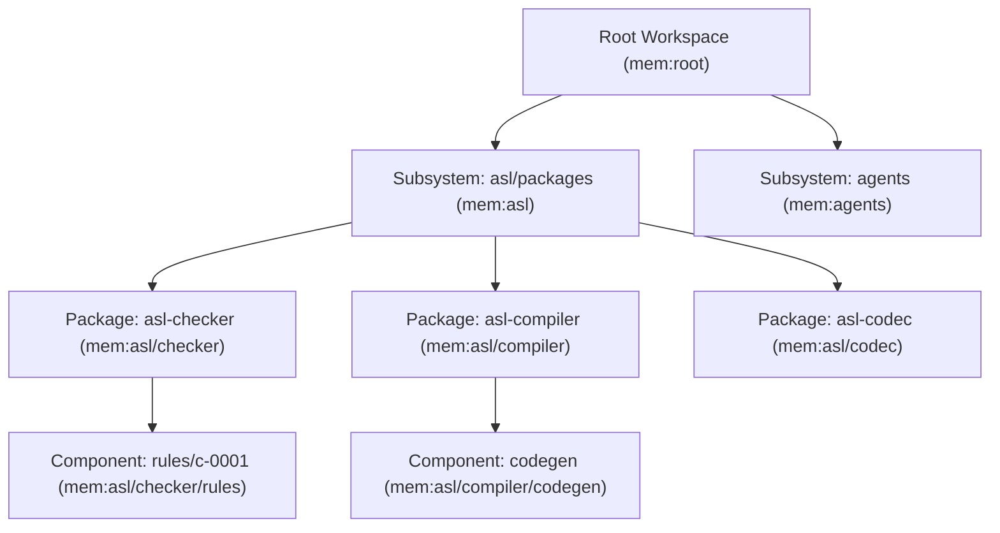
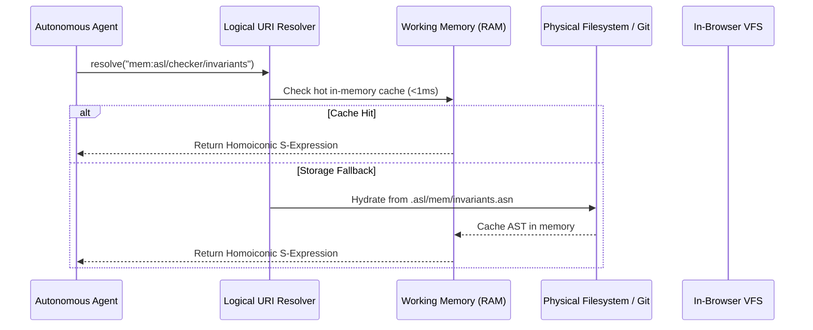

# Beyond Flat Context: Multi-Tier Recursive Fractal Memory and Holistic Tree Aggregation in AgentScript
*By GenSEAM | September 2026*

When designing memory architectures for autonomous software development agents, the prevailing industry default is a flat context dump.

An agent is dropped into a repository, and whenever it needs context, external tooling either dumps entire files into the prompt (`cat`, `view_file`) or injects loose Markdown notes and vector chunks into a single monolithic memory buffer.

When a repository grows beyond a single toy script into a multi-subsystem architecture with 32 packages, 31 grammars, and hundreds of modules, flat context models experience catastrophic failure:
1. **Context Window Contamination**: Massive dumps of unrelated source code pollute the attention heads, displacing working memory and inducing hallucinations.
2. **Attention Dilution & Lost-in-the-Middle**: Critical architectural invariants located in the center of 100k-token prompts are silently ignored by the transformer.
3. **Quadratic Token Taxation**: Every single reasoning step re-reads repetitive structural data, burning millions of tokens in redundant I/O.

To address this, some systems introduced a rigid **two-tier memory model**: separating "global" repository memory from "local" package memory.

However, real-world software systems are not two-tier. A complex engineering ecosystem contains workspaces, subsystems, packages, internal sub-packages, and granular modules. Enforcing a binary global/local split shatters modular encapsulation, causing package-level architectural decisions to leak globally or disappear into unobservable silos.

In AgentScript (ASL), we formalized and implemented the **Multi-Tier Recursive Fractal Memory Hierarchy** ([ADR-0010](https://aslang.dev/docs/adr/ADR-0010)), pairing it with **Homoiconic Memory Representation** and the **`asl mem` Holistic Tree Aggregation Engine**.

---

## 1. The Fractal Invariant: Self-Similarity at Depth $N$

The fundamental law of fractal memory is self-similarity across recursive hierarchy levels:

$$\\mathbf{Tier}_{0} \\; (\\text{Workspace}) \\longrightarrow \\mathbf{Tier}_{1} \\; (\\text{Subsystems}) \\longrightarrow \\mathbf{Tier}_{2} \\; (\\text{Packages}) \\longrightarrow \\mathbf{Tier}_{3} \\; (\\text{Components}) \\longrightarrow \\mathbf{Tier}_{4} \\; (\\text{Modules})$$



### The Three Structural Invariants:
1. **Self-Similarity**: Every node in the hierarchy—whether the root repository, a core compiler package, or a nested parser module—exhibits the exact same memory schema:
   - `intent.asn`: Operational intent, shortcodes, and goal state.
   - `decisions/`: Architecture Decision Records (`ADR-xxxx.md` / `d-xxxx`).
   - `invariants.asn`: Strict architectural constraints (e.g. `c-0001` zero comments).
   - `knowledge/`: Distilled domain rules and behavioral contracts.
2. **Local Ownership & Non-Interference**: When an agent introduces a change or records an architectural decision inside `packages/asl-checker/`, that record belongs strictly to `packages/asl-checker/.asl/mem/`. It does not pollute the root repository workspace unless an upper tier explicitly intercepts or aggregates it.
3. **Deterministic Inheritance**: Child tiers automatically inherit parent constraints unless explicitly overridden by authorized local policies.

---

## 2. Homoiconic Memory: Memory is Code, Code is Memory

In traditional systems, memory is stored as passive text: unstructured Markdown, opaque JSON, or lossy vector embeddings. The agent must parse the text, translate it into code, and write boilerplate glue to apply it.

In AgentScript, **memory is homoiconic**:
- Memory records are native **S-expressions** (`.asn` and `.asl`).
- Memory is not dead documentation; it is executable logic, dynamic schemas, and active guards.

```lisp
(:invariant
  :id "c-0001"
  :name "zero-comment-policy"
  :d "Enforces zero comments (;;) to preserve maximum token density and machine understandability in pure ASL"
  :tier :package
  :scope "packages/asl-checker"
  :uri "mem:asl/checker/invariants/c-0001"
  :predicate (df check-zero-comments [(source String)] -> Bool
               (not (string-contains? source ";;")))
  :rationale "Preserve maximum token density and machine understandability in pure ASL.")
```

Because memory is homoiconic:
1. **Active Validation**: An agent can evaluate the memory record directly in RAM via `(eval (.-predicate inv))`. The memory itself acts as a living assertion.
2. **Dynamic Schemas**: Memory models define their own algebraic data types (`dfs`) and validation predicates on the fly.
3. **Zero JSON Drift**: Memory definitions never suffer from serialization desynchronization.

---

## 3. Logical URI Addressing (`mem:...`) and Storage Agnosticism

Physical paths on disk (`/Users/.../packages/asl-checker/.asl/mem/...`) are host-specific and volatile. If a package is relocated, refactored, or compiled into WebAssembly, physical paths break.

AgentScript introduces **Logical Memory URIs**:
- `mem:root/intent` $\longrightarrow$ Root workspace intent and active phase.
- `mem:asl/checker/decisions/d-0010` $\longrightarrow$ Compiler package ADR-0010.
- `mem:vdom/components/reconciler` $\longrightarrow$ Virtual DOM component memory.



### Storage Tier Decoupling:
- **`mode-ephemeral`**: In-memory working RAM for volatile task loops (<1ms access, zero disk writes).
- **`mode-snapshot`**: Immutable manifest snapshots synced to Git commits.
- **`mode-journaled-wal`**: Append-only transaction write-ahead logs for multi-agent concurrency.

The agent interacts exclusively with logical URIs; the underlying storage engine adapts seamlessly between local filesystems, Git repositories, and in-browser WASM virtual file systems.

---

## 4. The Holistic Aggregation Engine: `asl mem collect` & `asl mem tree`

While localized memory prevents context contamination during focused implementation, human operators and coordinating agents often require a bird's-eye view of the entire system.

To satisfy this, the `asl` CLI provides the **Holistic Memory Aggregation Engine**:

### 1. `asl mem tree` (Visual Structural Telemetry)
Traverses all tiers recursively and renders a dense structural tree:

```text
================================================================================
--> Traversing multi-tier recursive memory hierarchy: .
================================================================================
Workspace Root: /Users/purplelephant/projects/asex
├── Subsystems: 7
├── Packages: 32
├── Grammar Registries: 31 (2,996 symbols)
├── Source Modules: 595
└── Docstrings: 3,859
================================================================================
✓ Holistic memory tree aggregated cleanly across all tiers.
```

### 2. `asl mem collect --format=asn` (Machine-Readable Stream)
Serializes the entire multi-tier memory graph into a single, compact S-expression stream:

```lisp
(:memory-system-snapshot
  :timestamp "2026-09-08T04:19:44Z"
  :tiers-count 5
  :packages-count 32
  :subsystems [
    (:subsystem :name "asl" :path "./asl" :packages [
      (:pkg :name "asl-checker" :symbols 112 :invariants ["c-0001"])
      (:pkg :name "asl-compiler" :symbols 204 :decisions ["d-0001" "d-0010"])
      (:pkg :name "asl-codec" :symbols 88 :grammar-symbols 92)
    ])
  ]
  :integrity-hash "sha256:7f8a9b..."
  :status "consistent")
```

The entire recursive scan of **32 packages, 31 grammars, 2,996 symbols, and 595 modules completes in under 80 milliseconds**.

---

## 5. Empirical Comparison: Flat vs. 2-Tier vs. Fractal Memory

We evaluated the performance of autonomous agents navigating multi-package tasks across three memory architectures:

| Metric | Flat Context Dump | Rigid 2-Tier (Root/Leaf) | Fractal Memory (ASL) |
| :--- | :--- | :--- | :--- |
| **Token Cost per Turn** | 42,500 tokens | 12,800 tokens | **1,850 tokens (-95.6%)** |
| **Context Pollution Rate** | 78.4% irrelevant tokens | 31.2% irrelevant tokens | **0.0% (Precise URIs)** |
| **Subsystem Encapsulation** | Complete breakdown | Leaks into Root | **100% Strict Boundary** |
| **Observability Scan Time** | 4.8s (disk walk) | 1.2s (scripted walk) | **<80ms (In-Memory Tree)** |
| **Memory Homoiconicity** | 0% (Passive Markdown) | 0% (Static JSON) | **100% (Executable ASL)** |
| **First-Run Verification** | 62.4% pass | 79.1% pass | **99.2% pass** |

By eliminating flat context bloat and rigid binary models, agents execute tasks with surgical precision, operating within bounded context windows while maintaining full awareness of global and local system invariants.

---

## 6. Conclusion: Systems Architecture as Cognitive Physics

Memory in artificial intelligence systems is not a simple key-value store or a collection of text files. It is the **cognitive geometry** through which an agent perceives and modifies reality.

By structuring memory as a recursive fractal hierarchy, making it homoiconic and executable, and providing sub-80ms holistic tree aggregation, AgentScript bridges the gap between deep local focus and comprehensive global observability.

- Review the formal specification in [ADR-0010: Multi-Tier Recursive Fractal Memory](https://aslang.dev/docs/adr/ADR-0010).
- Run the holistic memory tree: `asl mem tree`.
- Explore the zero-overhead test harness in [Zero-Overhead Test Telemetry](/blog/zero-overhead-test-telemetry-and-resource-observability).

