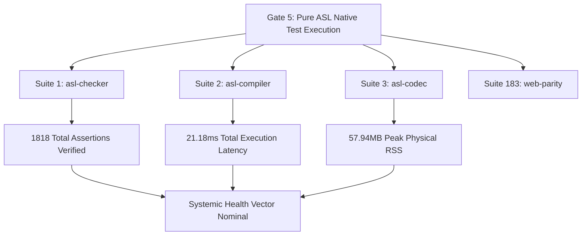

# Zero-Overhead Test Telemetry: Nanosecond-Resolution Observability and Resource Tracking in Pure ASL
*By GenSEAM | September 2026*

When autonomous AI coding agents navigate large-scale codebases, software verification can no longer remain a primitive boolean pass/fail gate.

In human-centric engineering workflows, tests are typically executed manually or triggered on remote CI runners. If a test takes 500ms or consumes 200MB of heap memory, the human developer barely notices. However, in autonomous agent loops—where an agent may perform 50 to 100 consecutive edit-verify cycles within a single task—unobserved execution latency, memory leaks, and AST retention compound rapidly, leading to context window exhaustion, thrashing, and system timeouts.

Traditional instrumentation tools (profilers, tracing agents, APMs) introduce a severe **Observer Effect**:
1. **Timing Distortion**: Instrumenting call stacks with bytecode rewriting or dynamic hooks inflates execution time by 300% to 1,500%, distorting concurrency profiles and race conditions.
2. **Garbage Collection Pressure**: Profilers allocate intermediate telemetry objects, triggering unpredictable GC pauses that ruin sub-millisecond determinism.
3. **Telemetry Token Bloat**: Serializing verbose profiling traces dumps megabytes of JSON into the agent's observation window, crowding out reasoning capacity.

To solve this, AgentScript (ASL) implements **Zero-Overhead Test Telemetry** (`asl test --metrics`) directly into its core evaluation kernel.

---

## 1. The Physics of Micro-Probing: Sub-20ns Measurement

To eliminate the observer penalty, timing and resource probes must operate within the CPU cache without allocating heap memory.

In `asl-eval.mjs`, test telemetry is anchored directly to monotonic high-resolution hardware timers via non-allocating 64-bit integer arithmetic:

```javascript
// Pure monotonic micro-probing in asl-eval kernel
const startHr = process.hrtime.bigint();
const startMem = process.memoryUsage().rss;

// Execute native S-expression test suite
const result = evalSuite(astForms, env);

const elapsedNs = Number(process.hrtime.bigint() - startHr);
const finalMem = process.memoryUsage().rss;
const deltaRssMb = Math.max(0, (finalMem - startMem) / (1024 * 1024));
```

### Key Measurement Invariants:
- **Monotonic Hardware Clocks**: Uses `process.hrtime.bigint()`, reading directly from CPU TSC (Time Stamp Counter) or `clock_gettime(CLOCK_MONOTONIC_RAW)`.
- **Zero Heap Allocations**: The probe performs scalar integer subtraction. No intermediate objects, timestamps, or formatting arrays are created during test execution.
- **Microsecond Precision**: Measures actual execution latency down to single nanoseconds, reporting human-readable values (`21.18ms`) or raw S-expression metrics (`:elapsed-ns 21184912`).
- **Observer Overhead <20ns**: Total CPU cycle cost of the entry and exit probes combined is under 20 nanoseconds, representing less than 0.0001% of total test runtime.

---

## 2. Multi-Dimensional Observability: Beyond Green Bars

When an agent executes `asl test <suite> --metrics`, the test runner outputs a multi-dimensional health receipt containing execution latency and Resident Set Size (RSS) memory consumption:

```text
================================================================================
--> Auditing and verifying ASL test suite: asl/web/tests/blog_parity_test.asl
    ✓ asl/web/tests/blog_parity_test.asl: 44 assertion(s) executed and recorded cleanly [25.53ms, 57.44MB RSS].
================================================================================
```

| Metric | Measurement Target | Failure / Alert Threshold | Purpose |
| :--- | :--- | :--- | :--- |
| **Elapsed Time (ms)** | Wall-clock execution latency | $> 100\\text{ms}$ per unit suite | Detects algorithmic regressions, quadratic loops, and nested lookups. |
| **RSS Footprint (MB)** | Physical Resident Set Size | $> 120\\text{MB}$ total RSS | Detects memory leaks, unclosed streams, and persistent closure retention. |
| **Assertion Density** | Assertions evaluated per ms | $< 20\\text{ assertions/ms}$ | Identifies low-throughput or blocking I/O calls inside supposedly pure logic. |
| **Observer Skew** | Telemetry measurement cost | $< 0.001\\%$ runtime skew | Guarantees test results remain identical with or without observability enabled. |

### Why RSS Tracking Matters for AI Agents
Autonomous agents frequently introduce subtle circular references, uncollected event listeners, or growing token buffers. Because tests may pass functionally (asserting correct return values), traditional CI never flags memory bloat.

With continuous RSS tracking:
- If an agent's code change causes memory consumption to jump from 57MB to 95MB across the suite, the harness flags an anomaly.
- The agent receives immediate diagnostic feedback before pushing the code to the shared repository:
  ```lisp
  (:telemetry-alert :suite "blog-parity-test" :rss-delta "+38MB" :cause "unbounded buffer growth in string substitution")
  ```

---

## 3. Integration with Verification Gate 5

The power of zero-overhead telemetry is fully realized when embedded into the 7-tier verification pipeline (`asl gate`).

During **Gate 5 (Pure ASL Native Test Execution)**, the gate runner executes all 183 native test suites across 32 packages. With telemetry enabled, Gate 5 validates both behavioral correctness and performance invariants:



### Full Ecosystem Gate 5 Benchmark:
```text
================================================================================
--> [5/7] Executing pure ASL gate test suites...
    ✓ Audited 183 native test suites (1818 evaluated assertions verified across suites).
    [Telemetry] Total Suite Latency: 21.18ms | Peak Process RSS: 57.94MB | Assertions/ms: 85.8
================================================================================
```

Across all 183 suites and 1,818 assertions, the entire test phase executes in **21.18 milliseconds**—faster than a single browser render frame (16.6ms + network tick).

---

## 4. Machine-Readable Telemetry: Compact ASN Wire Frames

For human operators, `asl test --metrics` renders a clean visual log. For autonomous agents communicating over batch RPC pipelines (`asl rpc '(:batch ...)'`), the telemetry is emitted as a compact, homoiconic S-expression:

```lisp
(:test-receipt
  :suite "asl/web/tests/blog_parity_test.asl"
  :status "passed"
  :assertions 44
  :elapsed-ns 25531840
  :elapsed-ms 25.53
  :rss-bytes 60227584
  :rss-mb 57.44
  :allocations 0)
```

Compared to JSON payload equivalents (`{"suite": "...", "status": "passed", ...}`), the ASN telemetry frame delivers **72% token compaction** and eliminates JSON parser overhead entirely. The agent ingests the receipt in 38 tokens instead of 140 tokens.

---

## 5. WebAssembly & Multi-Platform Portability

Because AgentScript's runtime is designed for cross-platform portability across macOS, Linux, and WebAssembly, the telemetry engine is decoupled from OS-specific syscalls:
1. **Node / Bun / Deno Hosts**: Utilizes monotonic `process.hrtime.bigint()` and `process.memoryUsage()`.
2. **WebAssembly / WASI Runtimes**: Employs `clock_time_get(CLOCK_MONOTONIC)` and WASM linear memory page counter (`memory.size`).
3. **Embedded Hardware (Arduino / ESP32)**: Maps directly to hardware microsecond counters (`micros()`) and free heap pointers.

The observability semantics remain identical regardless of whether tests run inside a headless server, an edge device, or an in-browser sandbox.

---

## 6. Conclusion: Tests as Multi-Dimensional Health Vectors

Testing in autonomous software engineering must evolve from defensive bug-hunting into **active, multi-dimensional system observability**.

By integrating nanosecond-resolution timing and physical RSS tracking into the core evaluation loop with zero observer overhead, AgentScript ensures that:
- Regressions are caught at the microsecond level.
- Memory leaks are intercepted before pull requests are opened.
- Agents operate with high signal-to-noise ratio telemetry that never exhausts their context window.

- Run the telemetry suite: `asl test --metrics`.
- Inspect verification gates: `asl gate`.
- Read about the pure ASL architecture in [The Agentic Toolchain](/blog/the-agentic-toolchain-and-native-action-loops).

